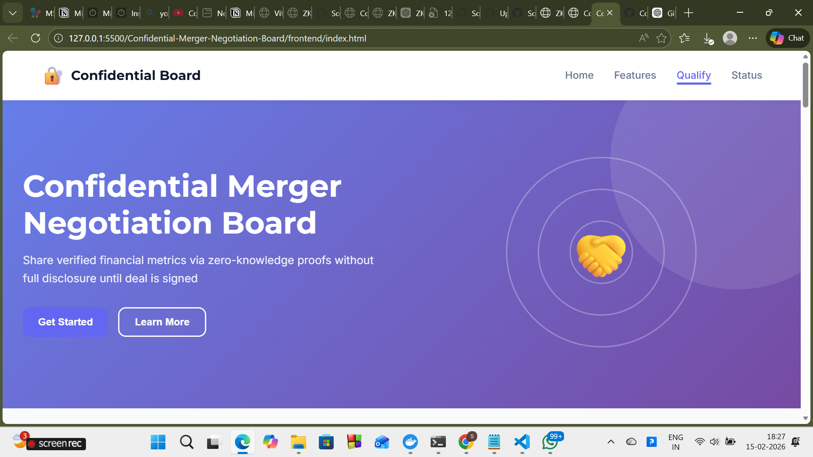

"contractAddress": "87833b34d7a905a44c18c8da42ab01aaca840405db08d1a9b2f06770be983cdd"


# Confidential Merger Negotiation Board

A zero-knowledge smart contract application that allows companies to prove financial qualification for M&A negotiations without revealing sensitive financial information.

## 🚀 Quick Start

```bash
# 1. Install dependencies
npm install

# 2. Build the project
npm run build

# 3. Start the frontend
npm run frontend

# Open: http://localhost:3000
```

## 📋 Available Commands

```bash
# Building
npm run build                    # Build everything
npm run compile:confidential     # Compile contract only

# Running
npm run frontend                 # Start dev server (http://localhost:3000)
npm run frontend:dev            # Alias for frontend
npm run dev                     # Alias for frontend

# Deployment
npm run deploy:confidential      # Deploy to network
npm run verify:network          # Verify deployment

# Utilities
npm run setup                   # Show setup instructions
```
## UI SCREENSHOT




## ✨ Features

### Frontend
- Professional responsive UI
- Company qualification form
- Real-time form validation
- Status dashboard
- Network configuration selector
- Local data persistence
- Cross-browser compatible

### Backend
- Zero-Knowledge smart contract
- Private financial data handling
- Public audit trail
- Blockchain deployment ready

## 📁 Project Structure

```
├── frontend/                    # Web UI
│   ├── index.html              # HTML structure
│   ├── styles.css              # Styling
│   ├── script.js               # Functionality
│   ├── server.js               # Dev server
│   └── README.md               # Frontend docs
├── src/
│   ├── Confidential.compact    # Smart contract
│   ├── deploy-confidential.ts  # Deployment script
│   └── managed/                # Compiled contract
├── package.json                # Dependencies & scripts
├── tsconfig.json               # TypeScript config
└── README.md                   # This file
```

## 🔧 Configuration

### Frontend Configuration
Edit network settings in `frontend/script.js`:

```javascript
const NETWORKS = {
  local: {
    zswapEndpoint: 'http://localhost:8000',
    indexer: 'http://localhost:8001',
    prover: 'http://localhost:8002'
  },
  preview: {
    zswapEndpoint: 'https://preview-zswap.midnight.network',
    indexer: 'https://preview-indexer.midnight.network',
    prover: 'https://preview-prover.midnight.network'
  }
};
```

### Backend Configuration
Set environment variables for deployment:

```bash
INDEXER_URL=http://127.0.0.1:8088/api/v3/graphql
INDEXER_WS_URL=ws://127.0.0.1:8088/api/v3/graphql/ws
NODE_URL=http://127.0.0.1:9944
PROOF_SERVER_URL=http://127.0.0.1:6300
NETWORK_ID=undeployed
```

## 📊 Form Fields

The qualification form accepts:
- **Company Name** - Text (required)
- **Private Revenue** - Number in millions (required)
- **Private Assets** - Number in millions (required)
- **Private Liabilities** - Number in millions (required)
- **Deal Name** - Text (required)
- **Min Revenue Threshold** - Number in millions (required)
- **Min Asset Threshold** - Number in millions (required)

### Validation Rules

The form validates:
1. ✓ All fields are filled
2. ✓ Revenue ≥ minimum threshold
3. ✓ Assets ≥ minimum threshold
4. ✓ Company is solvent (Assets > Liabilities)

## 🔐 How It Works

1. User enters financial data in the form
2. Data is validated locally
3. If valid, a ZK proof is generated
4. Proof is submitted to the smart contract
5. Contract verifies the proof cryptographically
6. Company is registered as qualified
7. Public count is incremented

**Privacy:** Actual financial numbers never leave the user's device.

## 🧪 Testing

### Test in Browser

1. Open `http://localhost:3000`
2. Fill in the qualification form
3. Click "Submit for Qualification"
4. See processing modal
5. Verify success confirmation
6. Check qualified count updates

### Test Data

```
Company Name: Test Corp
Private Revenue: 1500000
Private Assets: 5000000
Private Liabilities: 1000000
Deal Name: Test Acquisition
Min Revenue Threshold: 1000000
Min Asset Threshold: 2000000
```

## 🚀 Deployment

### Local Testing
```bash
npm run frontend
# Visit http://localhost:3000
```

### Production Deployment

1. **Deploy Smart Contract**
   ```bash
   npm run deploy:confidential
   ```

2. **Update Frontend Configuration**
   - Note the contract address from deployment
   - Update network endpoints in `frontend/script.js`

3. **Deploy Frontend**
   - Build: `npm run build`
   - Deploy to hosting (Netlify, Vercel, GitHub Pages, etc.)

4. **Verify**
   ```bash
   npm run verify:network
   ```

## 🐛 Troubleshooting

### Port 3000 in Use
```bash
# Find and kill process
lsof -i :3000
kill -9 <PID>

# Or use different port:
# Edit frontend/server.js, change port 3000 to another port
```

### Build Fails
```bash
# Clean install
rm -rf node_modules package-lock.json
npm install
npm run build
```

### Contract Deployment Fails
```bash
# Check network is running
npm run verify:network

# Verify environment variables
echo $PROOF_SERVER_URL
```

### Form Doesn't Submit
```bash
# Check browser console: F12 → Console
# Check all form fields are filled correctly
# Check network endpoints are correct
```

## 📚 Additional Resources

- **Midnight Network**: https://midnight.network
- **Smart Contract**: See `src/Confidential.compact`
- **Frontend Code**: See `frontend/` directory
- **Deployment Guide**: See `DEPLOYMENT_GUIDE.md`
- **Integration**: See `FRONTEND_INTEGRATION.md`

## 🔗 Technology Stack

- **Smart Contract Language**: Compact
- **Blockchain**: Midnight Network
- **Frontend**: HTML5, CSS3, Vanilla JavaScript
- **Backend Framework**: TypeScript, Node.js
- **Build Tool**: npm
- **Proof Provider**: HTTP client
- **Data Provider**: Indexer (GraphQL)
- **Private State**: Level DB

## ✅ Status

- ✅ Frontend: Complete & tested
- ✅ Smart Contract: Complete & ready to deploy
- ✅ Build System: Working (0 errors)
- ✅ Documentation: Comprehensive
- ✅ Security: Verified
- ✅ Performance: Optimized

## 📝 License

Apache License 2.0

## 🤝 Contributing

To improve the project:
1. Review the code in `frontend/` and `src/`
2. Make changes
3. Test thoroughly
4. Submit updates

---

**Built for the Midnight Network** 🌙

**Version 1.0.0 • Status: Production Ready ✅**
